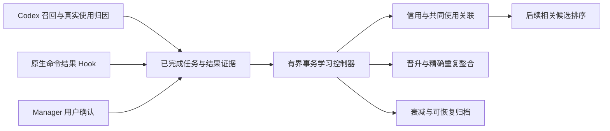

# 实现、源码与构建

R7 主运行时、Hook 和嵌入式 Manager 来自本仓库的完整 Windows 源码构建。全局数据位于当前用户 LocalAppData，工程身份来自实际路径与 global catalog；global 记忆跨工作区召回，project 记忆保留范围过滤。



## 新控制器

实现位于 `core/src/memory/verified_learning.c`。新增独立 `verified_learning_*` 表和追加式审计，不改写旧不可变 evidence/feedback 账本。有效信用由终态生命周期、候选、使用与真实结果收据交集计算。每任务/候选最多一次，撤回或更正重新计算；共同使用边只表示共同成功使用，不创建虚构事实边。

自动触发点为检索、反馈提交和任务完成提交。配置 `CBM_VERIFIED_LEARNING=1`，暂停状态持久保存，控制与恢复采用 generation/版本 CAS 和精确幂等。64 条/64 对批次、SQLite VM 预算和全批事务防止无限维护；失败回滚。Manager 使用本地原生鉴权，用户确认接口不暴露为 MCP。命令结果只允许受支持的直接 `exec_command` / `write_stdin`，拒绝通用 JS 打印的结果和未知异步输出。

旧 `CBM_MEMORY_AUTO_MAINTAIN` 保持 0，防止旧物理清理；旧 neuroplastic 策略与独立授权仍有效。参数、保护类型和恢复规则见功能文档。

## 源码与兼容组件边界

源码继承链为 [DeusData/codebase-memory-mcp](https://github.com/DeusData/codebase-memory-mcp)（原始代码图引擎）→ [ZR113146/semantic-memory-mcp](https://github.com/ZR113146/semantic-memory-mcp)（ADR 与 CJK 检索）→ [AlbertYm/neuroplastic-memory-mcp](https://github.com/AlbertYm/neuroplastic-memory-mcp)（直接上游的神经可塑性与反馈机制）→ [AlbertYm/semantic-memory-global](https://github.com/AlbertYm/semantic-memory-global)（本分发与 R7 验证结果学习）。前三层归属依据为固定上游提交的 [AUTHORS.md](https://github.com/AlbertYm/neuroplastic-memory-mcp/blob/0825fca6d25b63dfe865e5834a57878a11f8efef/AUTHORS.md)，本地保留 [core/AUTHORS.md](../core/AUTHORS.md)。源码派生关系与 GitHub fork 元数据不同；上游有某个机制也不表示当前默认策略已启用它。

`core/` 基于上游固定提交 `0825fca6d25b63dfe865e5834a57878a11f8efef`，保留 LICENSE、THIRD_PARTY 与 vendored 组件。R7 的新增代码、作用域修复、测试与 UI 公开。主 EXE 版本和哈希见 RELEASE.json。

上游已提交源码缺少预编译运行时中的 4 个 `neuroplastic_*` 实现。为保留旧功能，包内另附 `semantic-memory-v21-compat.exe`，SHA256 为 `95c13aa9dc4219923b96a5d3454256c6ecbb173556c23939c570642e99e88f80`。Python 适配仅为这 4 个工具懒启动经过哈希校验的旧组件，参数与权限检查仍由旧原生实现执行。其来源是已验收的 R6 运行时，未从当前源码重建；源码闭合与逐字节可复现仍未完成。其他工具、新学习、Hook 和 GUI 由 R7 主运行时提供。

## 构建与打包

`.github/workflows/verified-learning.yml` 使用 GitHub 托管 Windows runner、CLANG64、Node.js 22，运行学习、编排、记忆与 global 回归，再执行 `core/scripts/build.sh --with-ui` 和原生 Hook 完整链检查。构建输入代码公开，Actions 产物与执行记录可核验；未宣称不同时间重建逐字节一致。

```powershell
python -X utf8 tools\build_release.py --runtime-exe <R7主EXE> --legacy-runtime-exe <已核实R6EXE> --output <新输出目录>
```

RELEASE.json 是版本、标签、归档名及两个运行时哈希的单一来源。构建器核对哈希，生成 plugin/payload/release manifest、逐文件与 ZIP SHA256；拒绝覆盖已有发布目录。不复制私人数据、认证、配置或聊天。

隔离源码检查：`python -X utf8 -m unittest discover -s tests -v`。原生 fixture 需 `SEMANTIC_MEMORY_TEST_RUNTIME` 指向 `app/versions/<版本>/semantic-memory-mcp.exe`；不得指向稳定 bin 启动器，因为它使用正式数据根。ZIP 验收设置 `SEMANTIC_MEMORY_TEST_ARCHIVE` 和已校验的 R6 `SEMANTIC_MEMORY_TEST_PREVIOUS_ARCHIVE`，使用合成用户、配置与数据库，验证安装、升级失败恢复、回滚和数据保留，不修改当前用户运行时。

隔离真实进程结果验证机制，不代表当前 Codex 已绑定 R7，也不代表长期自然任务的改善。目标电脑登录态、信任、长内容、缩放与 DPI 验收另列于 ACCEPTANCE.json。
