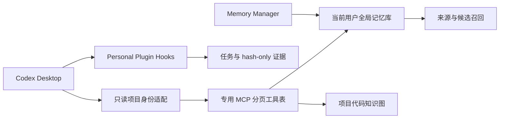

# 实现、源码与构建



全局库在当前用户 LocalAppData，工程身份来自实际路径与 global catalog。跨项目记忆的 scope_project 为 NULL；来源 project UUID 用于审计和有限相关性加成，不阻止其他工作区召回。

R6 的适配位于 `packaging/windows/memory-adapter`。它只读目录并把唯一匹配的旧名称转换为已登记 UUID；核心保持作用域、秘密和注入检查。独立维护事务同步 Codex/MMCAPI 的配置来源，不写记忆库，不改变 Hook 或原生二进制。R6 安装及适配运行需要 Python 3.11+；原生 payload 沿用 R5。

## 源码来源

`core/` 是 AlbertYm/neuroplastic-memory-mcp 的固定上游提交 `0825fca6d25b63dfe865e5834a57878a11f8efef`，包含 C 核心、上游测试、构建脚本、UI 源码和 vendored 组件。保留上游 LICENSE、THIRD_PARTY 和组件声明。公开来源及后续修改见 `patches/global-scope-source.patch`。

同步修复两个函数：旧 helper 用现有安全项目名验证器取代机器专属名称；已通过全局来源验证的 guard 允许 events/global，生命周期与其他工具的范围限制保持受控。代码索引、内容检测、受限 canary 与高级控制器不因该修复获得额外权限。

## 本次二进制的来源边界

运行时基线 SHA256：`d7f19eb5bf16c156cc2b9cc07230bbeed6ece017e029ec5cbe46a1fb7b2b3504`。

发布核心 SHA256：`95c13aa9dc4219923b96a5d3454256c6ecbb173556c23939c570642e99e88f80`。

本次发布使用精确基线局部二进制兼容修订。没有从 core 全量重编译，也没有验证特定编译器、依赖和所有构建参数可生成逐字节相同 EXE。源码同步修复可供审阅与后续重建；源码存在、补丁可重放、运行时验收、逐字节可复现是不同证据。

## 离线重放补丁

Python 3.11+，不需 Capstone：

```powershell
py -3 -X utf8 tools\apply_core_patch.py <原R4核心EXE> <新的输出EXE>
```

仅接受固定基线或已修订 SHA；逐区核对前后字节，最终校验整体 SHA，不覆盖未知输出，不改安装目录。没有该原始基线时可以审阅公开记录，并使用已校验的 Release EXE。

## 重新打包

版本、标签、归档名与原生 SHA 的单一来源为 `RELEASE.json`。R6 将持久修复纳入安装流程，并更新插件版本、版本 payload 标识及验收记录；原生核心未重建。开发期间如果存在 `unreleased_source_revision`，打包工具会在写入前停止，避免复用旧版本身份。

```powershell
py -3 -X utf8 tools\build_release.py --runtime-exe <已修订EXE> --output dist
```

打包工具只复制公开安装代码、插件、文档、许可证和已核实 EXE；生成 plugin/payload/release manifest 与逐文件/ZIP SHA256。输出目录存在时拒绝覆盖。不会遍历本机数据、备份、Codex Home 或凭据。

## 核心源码重建

维护代码的隔离测试：`python -m unittest discover -s tests -v`。真实原生 MCP 测试默认跳过；设置 `SEMANTIC_MEMORY_TEST_RUNTIME` 为受管理 `app/versions/<版本>/semantic-memory-mcp.exe` 后再运行同一命令。不要指向 `bin` 稳定入口，它会固定正式数据根；测试显式拒绝此路径。测试使用仓库忽略的 `build` 临时目录和合成配置，不读取使用者的认证、记忆或配置管理器数据库。

构建规则见 `core/Makefile.cbm` 与 `core/docs/`。Windows 原生工具链及上游依赖设置请按源码维护说明准备。本次没有执行完整核心编译，不把上游旧 CI 或本次包测试冒充源码重建证据。提交新的源码构建产物前，重新核对所有入口、manifest、完整分页工具协议、global/project 边界和目标电脑验收。

完整 ZIP 的隔离验收：设置 `SEMANTIC_MEMORY_TEST_ARCHIVE` 为待测 R6 ZIP，`SEMANTIC_MEMORY_TEST_PREVIOUS_ARCHIVE` 为已核对 SHA256 的 R5 ZIP，运行 `python -X utf8 tests/test_release_bundle.py`。测试从 ZIP 解压后运行安装入口，使用合成用户/配置/数据与 Windows PowerShell 5.1 内置模块路径；不修改当前用户安装。
